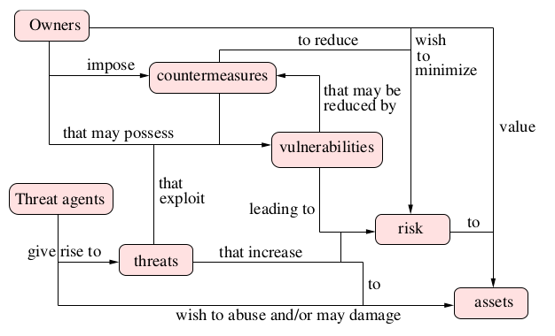

# Lesson

## Sum up of the Common Criteria



## Risk

**Risk** is defined as $R_i = P_i \cdot I_i$

Where

- $P_i$ is the probability of that the vulnerability is exploited
- $I_i$ is the impact of that vulnerability

The **total risk** is defined as $R = \sum_{i=1}^n R_i$

Total risk is never zero, the security professional's job is to make the tradeoffs necessary to bring the risk to an appropriate level.

Risk increases over time due to new vulnerabilities being discovered.

Countermeasures can be used to mitigate vulnerabilities and lower the total risk.

If after deploying countermeasures the risk is still deemed to be too high, the situation can be mitigated by offloading the risk to a third party via the means of **insurance**.

This also has opened up the job market for **_cyber security risk assessment_**.

## Security properties

- **Confidentiality** informations should only be available to the agents authorized to access them.
- **Integrity** information should not be (maliciousely) altered. Modifications are still possible for authorized agents.
- **Authentication** owners and data origin can be identified accurately. Each request should be validated and be rejected if the person/system that made the request has no right to perform the action/access the data.
- **Availability** the system should be accessible by its owners if they need it. **Denial of service attacks**: an attack, operated by a pool of machines consisting of bombarding a system with requests, overloading it and eventually bringing it offline for legitimate users.
- **Accountability** any action should be associated with a principal(human or machine). Any required security policy violation should be tracked.

**Security mechanisms**: techical measures that enforce security policies to ensure the security properties.

System security is not only applicable to software and hardware but also to humans and processes.

## Countermeasures

- **Prevention** that happens during the design process of a system (security by design).
- **Detection** by observing the system behaviour and reacting to strange behaviour.
- **Response** after the breach has happened.

## Privacy and secrecy

Privacy implies ownership of data, which is associated with an individual.

The owner might not be the custodian of the data.

Secrecy is instead associated with an organization.

Anonymity is the concept of keeping an individual's data private, protecting its identity.

## Cryptography

Allow untrustworthy communication channel into a trustworty one.

### History

Cryptography descends from secret writing.

Its sibling is steganography which is a mean to hide data inside other data.

### General cryptographic schema

```text
             Encryption key                  Decryption key
                    |                               |
                    V                               V
Plaintext -> [ Encryption ] -> Ciphertext -> [ Decryption ] -> Plaintext
```

$E_{EncryptionKey}(Plaintext) = Ciphertext$

$D_{DescryptionKey}(Ciphertext) = Plaintext$

| Encryption type |            Implication             |
| --------------- | :--------------------------------: |
| **symmetric**   |  $EncryptionKey = DecryptionKey$   |
| **asymmetric**  | $EncryptionKey \neq DecryptionKey$ |

Cryptography should only depend on a the key: encryption and/or decryption implementation might even be public and the secrecy should be preserved.

Cryptography implementations are usually public in order to benefit of peer-review of algorithms.

The key should be always transferred securely.

### Brute force attack

Trying all possible combinations, leads to an explosion in complexity and leads to extremely long computation times.

#### Brute force attack on a physical lock

The key is inserted inside the lock, pushing the pins away and unlocking the rotor, allowing the door to be opened.

A brute force attack might try every possible key "shape", leading to trying millions of keys.
